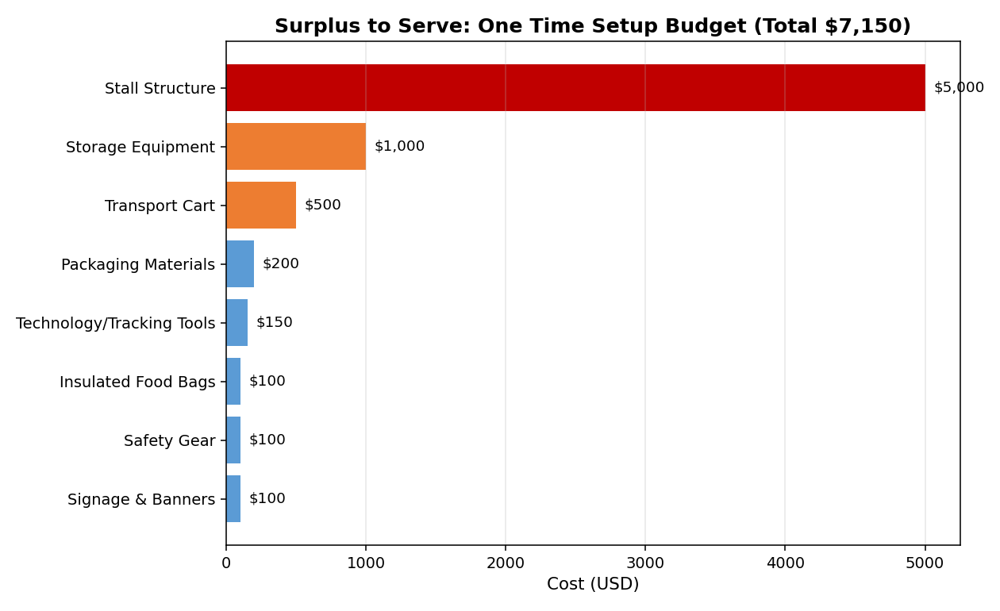
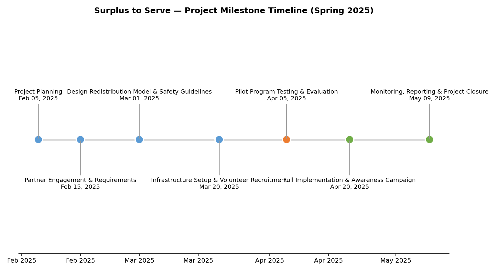
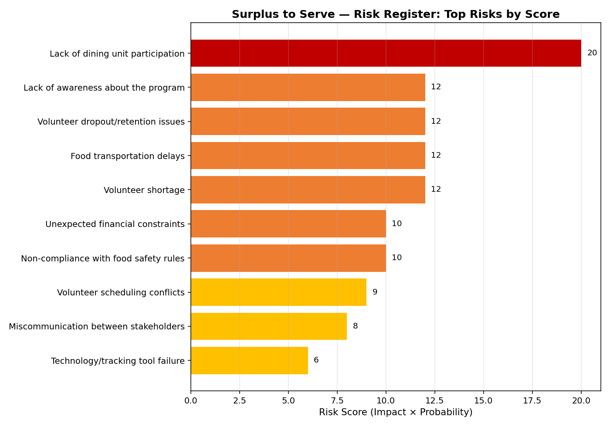
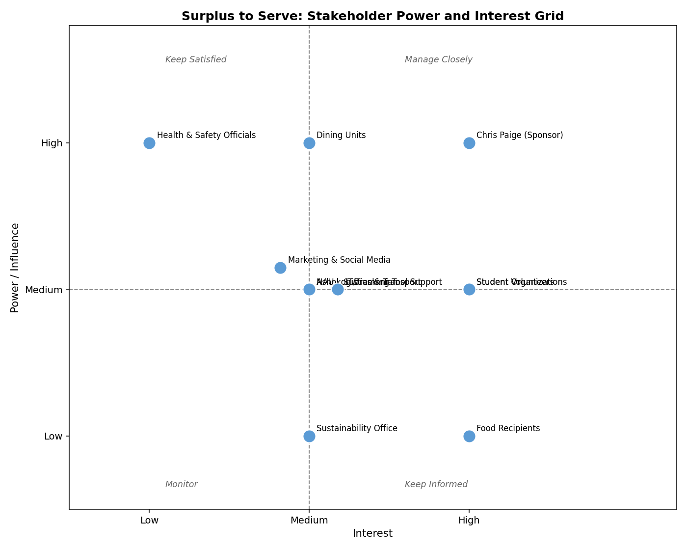
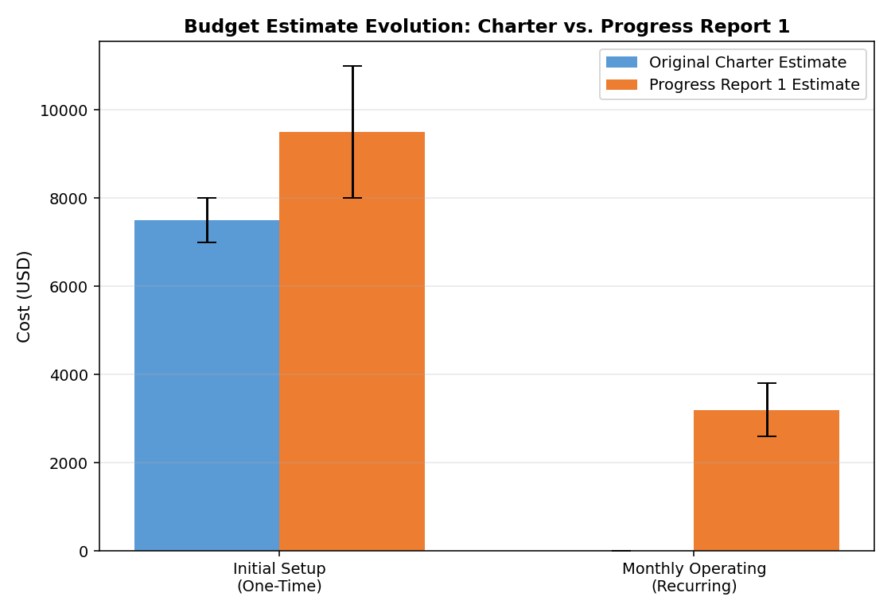

# Surplus to Serve

### A semester spent turning campus food waste into a real plan for feeding people

**ISM 555, Project Management, Northern Arizona University, Spring 2025**
**Team 3, Project Manager: Vamshi Aitharaju**
**With Bhavani Durga Koukuntla, Navya Sri Katta, and Jahnavi Chalapaka**
**Sponsor: Prof. Chris Paige**

`Project Charter` `Scope and WBS` `Scheduling` `RACI` `Risk Management` `Stakeholder Analysis` `Communication Planning`

---

## The Problem

When our professor assigned this project, the easy path was obvious: pick one of the standard project ideas that past students had already done, plug in new names, and move on. I did not want to do that. I wanted to build something that came from an actual problem I had seen myself, not a recycled idea from a folder of old submissions.

I found that problem at my own job. I work as a food service worker in campus dining, and I watched, shift after shift, how much good food gets thrown away at the end of the day. Every day, NAU's dining halls (Hotspot, Dub's, Coops, Pizza Hut, Cobrizo) end up with surplus food. Most of it gets composted. Composting is not wrong by itself, but a few miles away, and sometimes a few dorms away, students and community members deal with food insecurity. I was standing in the middle of two problems sitting right next to each other, unconnected, and I already had the access and the context to see exactly how they could be connected.

Surplus to Serve started as an answer to that gap: a real system for collecting, safely handling, and redistributing surplus food. This was a simulation project for the course, not something we actually deployed, but it was real enough that when I described the idea to my own dining hall manager and supervisor, they were genuinely enthusiastic and said they wished something like this could actually be implemented. That reaction is a big part of why I stayed committed to building this out properly instead of treating it as just another assignment.

From there, it became a plan built the way an actual project gets built, one deliverable at a time, over a full semester, with a real budget, a real schedule, and a team that had to actually coordinate to make it work.

A note on authorship before the story starts: this was a four person team project. All four names appear across these deliverables, and I served as Project Manager, leading overall coordination, signing the charter, running the communication plan, and driving the team's weekly cadence. Where a specific deliverable was led by a teammate, that is noted honestly rather than smoothed over.

## Skills Demonstrated in This Project

| Skill | How I Used It Here |
|---|---|
| Project chartering | Defined the project purpose, deliverables, budget, and high level risks before any work began |
| Scope management | Set clear boundaries for what the project would and would not cover, to keep a food safety sensitive project achievable in one semester |
| Work breakdown structures | Broke the full project into five phases and task level detail |
| Scheduling | Built the project timeline in Microsoft Project across seven milestones |
| RACI matrix design | Assigned Responsible, Accountable, Consulted, and Informed roles across every task and six stakeholder groups |
| Risk management | Identified ten risks, scored each by probability and impact, and assigned a specific mitigation to each one |
| Stakeholder analysis | Mapped eleven distinct stakeholder groups by power, interest, and awareness |
| Communication planning | Built a full communication matrix defining who hears what, how often, and through which channel |
| Team leadership | Coordinated a four person team as Project Manager across a full semester |

---

## Chapter 1: Starting With Why, and With a Real Number

Every project starts with a document that answers one question: why does this exist, and who is accountable for it. Writing the charter meant turning a good instinct, food is going to waste while people go hungry, into something specific enough to actually fund and staff.

The budget is where the idea stopped being abstract. A single stall structure alone would cost $5,000, more than two thirds of the entire one time setup budget.



Total setup landed between $7,000 and $8,000, plus ongoing monthly costs for packaging, volunteer incentives, and emergency transport. Putting real numbers on the idea early, before a single volunteer was recruited, is what turned Surplus to Serve from a nice thought into something a sponsor could actually approve. The charter also named the project's biggest risks on page one, not page ten: dining units might not participate, volunteers might not show up, food safety could go wrong. Naming those risks before any work started is what made the rest of the semester manageable instead of reactive.

📄 [Read the full Project Charter](reports/01_Project_Charter.pdf)

## Chapter 2: Deciding What This Project Would Not Do

A charter says why a project exists. A scope statement says exactly what it will do, and just as importantly, what it will not. This is the chapter where the team had to say no to good ideas in order to protect a food safety sensitive project running on a single semester clock.

The scope stayed deliberately narrow: on campus only, pre packaged safe to distribute food only, no cooking, no off campus sourcing, no home delivery. Every one of those boundaries was a real conversation, since each one closed off a direction the project could have grown into. From there, the Work Breakdown Structure turned that narrowed scope into five phases, Initiation, Planning, Execution, Monitoring and Control, and Closure, each broken down to task level. That is the difference between saying "make this happen" and having an actual, checkable list of what making it happen requires.

📄 [Read the full Scope Statement](reports/02_Scope_Statement.pdf) or the [full Work Breakdown Structure](reports/03_Work_Breakdown_Structure.pdf)

## Chapter 3: Putting Dates on the Plan

A plan without dates is just a wish list. The schedule, built in Microsoft Project, is what turned Surplus to Serve into a real, time bound commitment instead of a semester long intention.



Seven phases, from initial partner outreach in early February through full implementation and closure by early May. Every deliverable in this repository was built against this exact timeline, under the same deadline pressure any real project team works under.

## Chapter 4: Making Sure Ownership Was Never Vague

By this point in the semester, the plan was real, but a plan with no ownership is just a wish list with extra steps. The RACI matrix is where "the team will handle food safety" became something specific: the Project Team is Responsible, the Sponsor is Accountable, and Dining Services is Consulted. Every task in the Work Breakdown Structure got mapped against six roles, Project Manager, Sponsor, Key Stakeholder, the Project Team, Dining Services, and Student Organizations and Volunteers, specific enough to actually run a weekly status check against instead of hoping everyone remembered what they signed up for.

📄 [Read the full RACI Matrix](reports/04_RACI_Matrix.pdf)

## Chapter 5: Naming What Could Go Wrong Before It Did

Every project has a moment where optimism has to meet a harder question: what actually breaks this. For Surplus to Serve, that meant sitting down and naming ten specific risks, then scoring each one honestly.



The top scoring risk was not some rare disaster. It was the most obvious one: dining units simply not participating, scored 20, since the entire project depends on food actually showing up in the first place. The mitigation was not hope, it was relationship building and incentive design, work that started well before launch. Further down the list, a smaller risk got a deliberately low tech answer. If the $150 tracking tool ever failed, the backup was a manual paper process, because a broken Google Form should never be the reason food does not reach someone who needs it.

📄 [Read the full Risk Register](reports/05_Risk_Register.pdf)

## Chapter 6: Learning Who Actually Needed to Be in the Room

It is easy to plan around the obvious people, dining units, volunteers, the sponsor, and forget the quieter stakeholders who can still make or break a project. Building the stakeholder analysis meant deliberately looking for the groups that were easy to overlook, like the Sustainability and Composting team and Health and Safety officials, and being honest about how much power and interest each group actually had.



Placing every stakeholder on this grid is what shaped everything that came after it. Groups in the top right, like our sponsor, needed close, frequent contact. Groups in the bottom left, like the IT tracking tool team, just needed to stay informed. This grid was not a formality, it became the actual blueprint for the communication plan in the next chapter.

📄 [Read the full Stakeholder Analysis](reports/06_Stakeholder_Analysis.pdf)

## Chapter 7: Closing the Loop With Communication

A plan is only as good as whether the right people hear about it at the right time. The communication matrix took every stakeholder from that grid and gave them a communication plan actually shaped to how they operate, not a single generic update sent to everyone. Bi weekly team meetings. Monthly sponsor status reports. Weekly awareness campaigns on Instagram and campus flyers for student beneficiaries. Weekly transportation coordination over email and WhatsApp. This is the deliverable that turns a good plan into a team that is actually still talking to each other by week ten.

📄 [Read the full Communication Matrix](reports/07_Communication_Matrix.pdf)

## Chapter 8: Checking the Plan Against Reality

A plan that never gets checked against reality is not being managed, it is just sitting on a shelf. Twice during the semester, the team stopped and reported honestly on where things actually stood against the original charter, not just where we hoped they stood.

**Progress Report 1: Planning and Design**

By the first checkpoint, the project was in its Planning and Design phase. Partner engagement with dining units was underway, food safety requirements had been gathered, and initial resources had been estimated. Next steps were clear: finalize the redistribution model, and start recruiting volunteers.

One honest update showed up here too. The original charter estimated setup costs at $7,000 to $8,000. By this checkpoint, that estimate had grown to $8,000 to $11,000, with recurring monthly costs of $2,600 to $3,800 once operations were running.



That is not a planning failure, it is what planning is supposed to catch. A charter is written with the best information available at the time. As partner conversations happened and real requirements came into focus, the number moved, and the team reported that change honestly instead of quietly absorbing it. The budget was marked on track despite the increase, since the revised estimate was still fully funded and accounted for.

This checkpoint also restated the project's core risks in sharper focus: dining unit participation, volunteer availability, and food safety compliance, each with the same mitigation strategy carried over from the original risk register, proof that the risk planning from Chapter 5 was still holding up under real conditions. The checkpoint closed with a simple, honest summary: on track and on budget, strong support from stakeholders, with sustainability and community impact still the project's core focus.

**Progress Report 2: Overall Status Green, and What Actually Happened**

By the second checkpoint, the project reported an overall status of green across every tracked dimension, and this time the presentation included the specific dates of what had actually happened, not just what was planned. Planning started February 15 and wrapped by the end of that month. March was spent recruiting and training the volunteer team. By March 30, every food safety step was in place. On April 19, the team ran a pilot test, and it worked. Full operations officially launched May 1.

The honest part of this update is what happened in between those dates. The team did run into real problems: volunteer shortages on some days, and a few transportation delays. Neither one was hidden or smoothed over in the report. Both got a real fix instead: a backup volunteer list to cover shortages, and alternate transport arrangements to keep food moving when the primary plan fell through. That is the entire point of building a risk register and a communication plan back in Chapters 5 and 7. When something actually went wrong, the team already had a way to respond instead of scrambling.

Risk and mitigation: green, with volunteer availability and food safety both actively managed. Stakeholder engagement: green, with regular updates, active partnership with student organizations, and direct, ongoing involvement from our sponsor, Chris Paige.

That is not a dramatic ending, and that is the point. A project staying quietly on track through two separate checkpoints, hitting real problems and solving them instead of getting derailed by them, because the charter, the schedule, the RACI matrix, the risk register, and the communication plan were all doing their job together, is what project management is actually supposed to look like.

📄 [Progress Report 1](progress-reports/Progress_Report_1.pdf) or [Progress Report 2](progress-reports/Progress_Report_2.pdf)

---

## What This Project Demonstrates

- Full project management lifecycle fluency, from charter through closure, not just one piece of it
- Risk first thinking, with risks named early, scored, and given a specific mitigation rather than a general warning
- Stakeholder aware planning, covering eleven distinct groups including the ones that are easy to overlook
- Real budgeting discipline, with actual itemized dollar estimates instead of placeholders
- Team leadership, coordinating a four person team as Project Manager across a full semester

## Tools and Skills

Project Charter Development, Scope Management, Work Breakdown Structures, Microsoft Project (Scheduling), RACI Matrices, Risk Register and Qualitative Risk Assessment, Stakeholder Analysis, Communication Planning

## Repository Structure

```
assets: budget breakdown, budget evolution, milestone timeline, risk chart, and stakeholder grid
reports: all 7 core PM deliverables, as PDF
progress-reports: 2 mid semester status reports, as PDF
```

Note on file formats: the schedule was originally built in Microsoft Project, a format that is not easily viewable outside that software. The milestone timeline shown above is built directly from the charter's official schedule data instead. All original working files are kept in a private archive.

---
### About the Author
**Vamshi Aitharaju**, Project Manager, Team 3
Email: aitharajuvamshi@gmail.com
GitHub: [github.com/aitharajuvamshi-cell](https://github.com/aitharajuvamshi-cell)

This was a team authored academic project for ISM 555. Team members: Vamshi Aitharaju (Project Manager), Bhavani Durga Koukuntla, Navya Sri Katta, and Jahnavi Chalapaka. Copyright 2026. All rights reserved.
